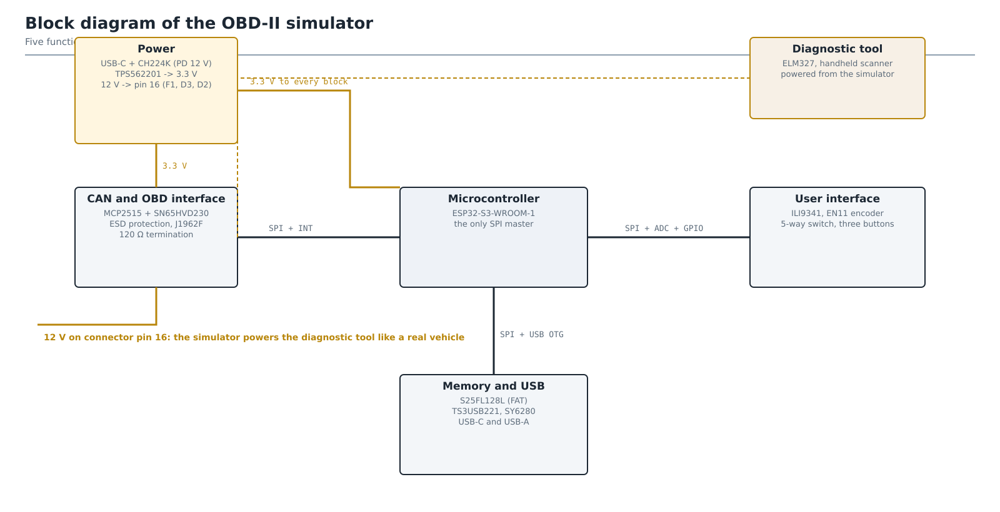

# OBD-II Simulator

Open-source OBD-II simulator board that answers a diagnostic tool over CAN
exactly as a vehicle ECU does. The repository has three parts:

- the **protocol core** (`include/`, `src/`, `tests/`) - portable,
  host-testable protocol and simulation layers with no external
  dependencies, described below,
- the **firmware** (`firmware/`) - PlatformIO project for the device
  itself (FreeRTOS tasks, MCP2515 SPI driver, TFT_eSPI user interface,
  16 MB SPI NOR flash storage with USB-C MSC / USB-A stick transfer), which
  compiles the core unchanged and plugs into it through the small set of
  `extern` platform hooks listed below. See `firmware/README.md`,
- the **board** (`hardware/`) - the KiCad project, gerbers, bill of
  materials and the scripts that generate the board, at revision **v0.7**
  (130 x 115 mm, two-layer FR4, ESP32-S3-WROOM-1). See `hardware/README.md`.



The simulator answers a diagnostic tool over CAN and, like a real vehicle, powers
it from pin 16 of the J1962 connector. The protocol core described below is what
runs inside the "Microcontroller" block, and everything around it is documented
in [`hardware/README.md`](hardware/README.md), which walks through the same
schematics one design decision at a time.

Everything in the repository is in English. The project also keeps a set of
Croatian working documents, which live outside it.

The **v0.7 board has been fabricated and assembled** in one unit. A commercial
ELM327 adapter connects to it, reads all 21 parameters and the fault codes, and
draws its own 12 V from pin 16 while doing so.

## Where to read what

The wiki is written for someone using or rebuilding the device. The files in
this repository are the record of how it was built and why. Both languages of
the wiki carry the same content.

| Question | Wiki page | In this repository |
|---|---|---|
| What is this and what can it do | [Home](../../wiki/Home) | this file |
| How do I build one | [Building the device](../../wiki/Building-the-device) | [`hardware/README.md`](hardware/README.md), and [`hardware/gerber/README.md`](hardware/gerber/README.md) before ordering |
| How do I compile and flash it | [Firmware](../../wiki/Firmware) | [`firmware/README.md`](firmware/README.md), and [`firmware/tools/README.md`](firmware/tools/README.md) when the ordinary upload path is unavailable |
| How do I drive it | [Usage](../../wiki/Usage) | [`scenarios/README.md`](scenarios/README.md) for the JSON format |
| How do I contribute | [Contributing](../../wiki/Contributing) | the conventions below |
| How is the board generated | - | [`hardware/kicad/scripts/README.md`](hardware/kicad/scripts/README.md) |

Two internal documents govern changes to this project, and neither is published
here: `docs/MAPA-POVEZANIH-DATOTEKA.md` is an "if you change X, check Y" table,
because the same fact is written down in up to six places, and
`docs/combined/DNEVNIK-IZMJENA.md` is the chronological record of every decision.
Both are in Croatian and are working notes rather than product documentation, so
`docs/` is deliberately left out of the repository.

## Modules

| File | Purpose |
|------|---------|
| `include/obd2_pids.h` | Mode/PID constants per SAE J1979 / ISO 15031-5 |
| `include/sensor_table.h` | 21 simulated parameters with ranges and noise |
| `src/pid_encoder.cpp` | Value → raw bytes codec + supported-PID bitmasks |
| `include/dtc_bank.h` | DTC bank (pending/confirmed, MIL, freeze frame) |
| `src/iso_tp.cpp` | ISO 15765-2 transmit path (SF, FF/FC/CF) |
| `src/can_handler.cpp` | Request dispatcher, modes 0x01-0x09 |
| `src/simulator_core.cpp` | Simulation profiles (Manual / Idle / Drive) |
| `tests/test_simulator.cpp` | Host-side unit tests |

Implemented services: 0x01 (current data, 21 PIDs), 0x02 (freeze frame),
0x03/0x07 (stored/pending DTCs), 0x04 (clear DTCs), 0x09 (VIN).
Unsupported services receive the negative response `7F <mode> 11`.
Requests are accepted on 0x7DF (functional) and 0x7E0 (physical), while
responses are sent on 0x7E8. Frames are padded to 8 bytes with 0x55
per ISO 15765-4.

## Platform hooks (implement on target, stubbed in tests)

```cpp
uint32_t millis();                                // ms since boot
void     can_send_frame(const CanFrame& frame);   // MCP2515 transmit
bool     iso_tp_wait_flow_control(FlowControl&);  // wait for FC frame
void     iso_tp_delay_us(uint32_t us);            // STmin pacing
```

## Building and running the tests

```sh
cmake -B build
cmake --build build
ctest --test-dir build --output-on-failure
```

The same tests also run through PlatformIO (`pio test -e native` inside
`firmware/`). Firmware build: `pio run -e custom-board` (the dedicated
ESP32-S3 board, also used on the breadboard adapter during development).

## Regenerating the board

The board is generated rather than drawn: there is no `.kicad_sch`, and the
`.kicad_pcb` is an output. Two entry points, and picking the wrong one costs
work:

```powershell
# a part, a net or the placement changed - rebuilds and re-routes from nothing
powershell -ExecutionPolicy Bypass -File hardware\kicad\scripts\route_board.ps1

# the board file is already right, only the derived files are stale
powershell -ExecutionPolicy Bypass -File hardware\kicad\scripts\regen_outputs.ps1
```

`route_board.ps1` ends by recomputing all 103 reference designator positions and
so **discards the hand-tuned silkscreen**. If no copper moved, run only
`regen_outputs.ps1`. Every step of the chain, what it writes and where, is in
[`hardware/kicad/scripts/README.md`](hardware/kicad/scripts/README.md).
