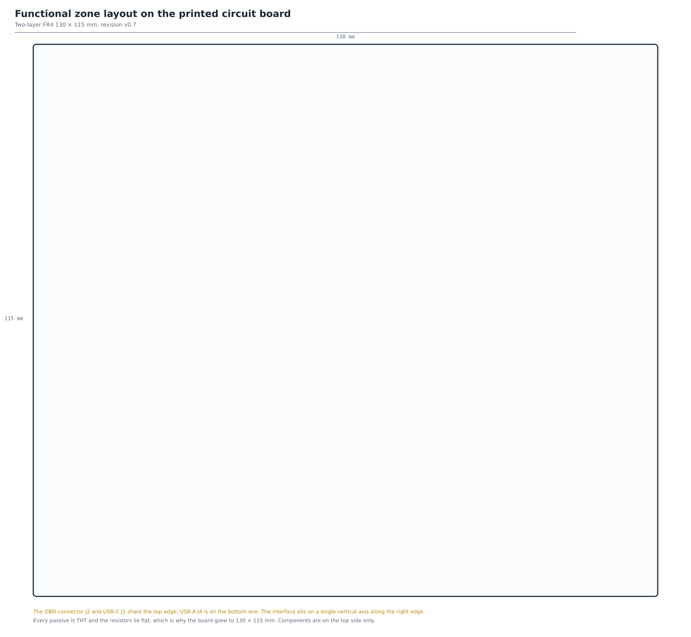
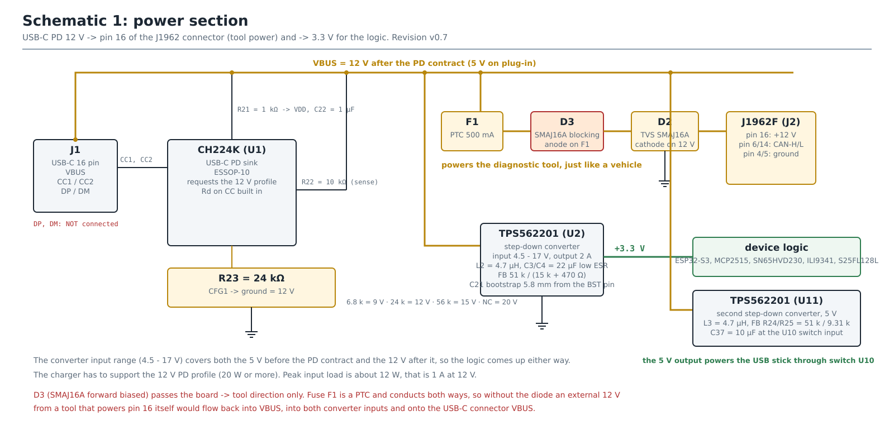
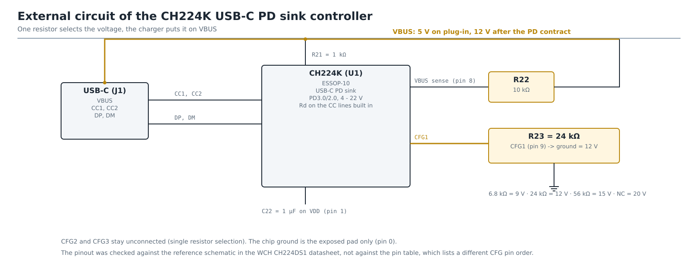
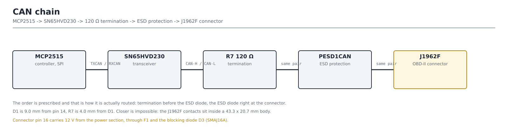
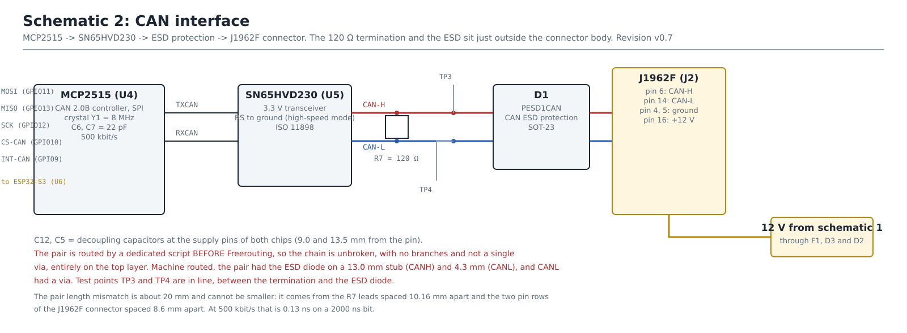
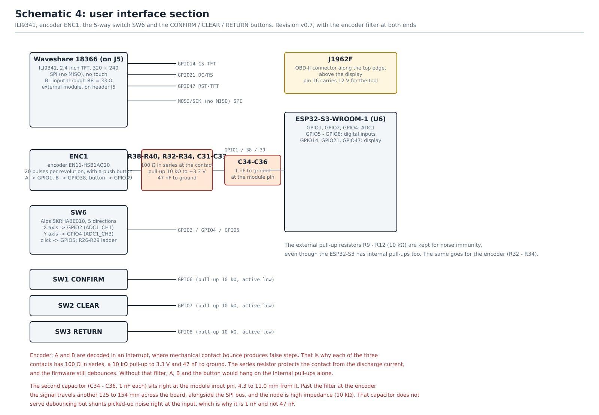
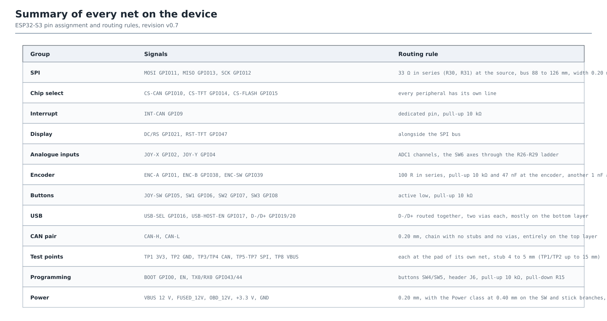
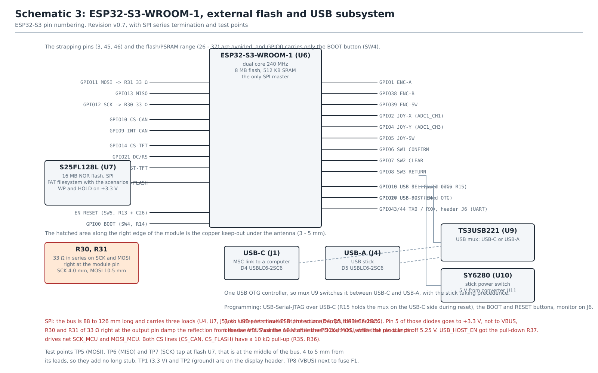

# OBD-II simulator board, revision v0.7

The final hardware of the project: a dedicated two-layer board **130 x 115 mm**
with an ESP32-S3-WROOM-1 module, the CAN chain MCP2515 -> SN65HVD230 ->
PESD1CAN -> J1962F, and power over USB-C Power Delivery.


The five blocks in that diagram are the ones the rest of this document keeps
naming: **power** (USB-C PD to 12 V and 3,3 V), the **CAN and OBD interface**
(MCP2515 to SN65HVD230 to the J1962F socket), the **microcontroller**, **memory
and USB**, and the **user interface**. The dashed arrow is the diagnostic tool,
which the simulator both answers and powers, over pin 16 of the connector.

Every figure in this file is drawn by `kicad/scripts/generate_figures.py`. It
draws them **by hand rather than deriving them from the board**, so a figure does
not follow a board change on its own, and after a change to the schematic it has
to be redrawn there. The full set is listed in [Figures](#figures) below.

The board **has been fabricated and assembled** in one unit, and the core of the
device was verified on it with a commercial ELM327 adapter. Numbers about the
board itself are still measured from the project file
`kicad/obd2-simulator.kicad_pcb` or taken from tool output, never copied from an
earlier version of this text.

Wiki page for anyone building one: **Building the device**, on the repository
wiki. It has the bill of materials, the pinout and the first-power-up procedure. This
file is the design record behind those instructions, decision by decision.

**How the board is generated is a subject of its own**, and it has its own index
in [`kicad/scripts/README.md`](kicad/scripts/README.md): which of the two entry
points to run, what each step of the routing chain is for and which derived file
lands where.

## Board state (measured with the tools)

| Item | State |
|---|---|
| Outline | 130 x 115 mm, two-layer FR4 1,6 mm, 4 x M3 in the corners (spacing 120,00 x 105,00 mm) |
| Footprints | **107** (95 parts to solder + 8 test points + 4 mounting holes), of which **16 SMD** |
| Nets | **64 named**, ground included |
| Routing | **892 segments** (639 top layer, 253 bottom), **73 vias** (72 x 0,60 / 0,30 mm and one x 0,80 / 0,40 mm on V5_STICK), fully routed |
| DRC | **0 errors, 0 warnings, 0 unconnected** (`kicad-cli pcb drc --severity-all`) |
| Mask | black, silkscreen white, ENIG finish |
| Components | all on the top side, the bottom is copper, mask and legend only |

A note on that DRC: it is clean **partly because some rules are switched off**.
The project has `min_silk_clearance = 0` and
`solder_mask_to_copper_clearance = 0`, and `missing_courtyard` is set to
"ignore". The claim "0 warnings" therefore does not by itself mean the silkscreen
has been checked.

**Checked separately on 10.08.2026.** by running DRC over a copy of the project
with those rules restored (`min_silk_clearance` 0,15 mm,
`solder_mask_to_copper_clearance` 0,05 mm, hole spacing 0,50 mm). Outcome:

| Finding | Count | Verdict |
|---|---|---|
| Silkscreen over a pad | **0** | clean, the earlier suspicion is settled |
| Mask bridge between nets | **0** | the openings do not merge, but the bridges are 0,150 mm, see below |
| Silkscreen clipped by the board edge | 2 | J4, 0,140 mm, cosmetic |
| Hole spacing under 0,50 mm | 21 | see `gerber/README.md`, the geometry of connector J1 |
| Footprint type does not match its pads | 1 | U1, an attribute of a custom footprint, no effect on fabrication |

## Contents of this directory

| Contents | What it is |
|---|---|
| `kicad/obd2-simulator.kicad_pcb` | The KiCad board project: footprints, netlist, placement, routing, ground pour, keepout around the antenna |
| `kicad/scripts/` | the scripts that generate the board (KiCad Python API + Freerouting), together with `PRE-FABRICATION-CHECKLIST.md` |
| `kicad/scripts/docx/` | `.docx` tooling that needs no Word: `md2docx.py` builds the technical documentation from Markdown, the rest edit text, tables and the table of contents. Moved here 15.08.2026., has its own `README.md` |
| `kicad/footprints/obd2.pretty/` | custom footprints: CH224K, SEP-A-OBD-D2, SKRHABE010, RK12L12C0A0G |
| `kicad/3dmodels/` | custom VRML models for the render, generated by `scripts/gen_3dmodels.py` |
| `kicad/render-top.png`, `render-bottom.png` | 3D renders |
| `gerber/` | Gerber layers, Excellon drill, gbrjob and the package for the fabricator |
| `schema1.svg` - `schema4.svg`, `blok.svg`, `canchain.svg` | schematics and the block diagram, in English, generated by `scripts/generate_figures.py`. **Not used in the written documentation**, see the note below the table |
| `kicad/scripts/fig/` | every figure the generator draws. The six above are copied up into this directory, and three more are used from here: `zones.svg` (functional zone layout), `nets.svg` (all net groups with their routing rule) and `ip2368.svg` (the external circuit of the CH224K, the file name is that of the part the design started with) |
| `bom/bom-pcb.csv` | parts list with suppliers, order codes and prices |
| `bom/bom-pcb.md` | quantities, values, tolerances and packages, with soldering notes |

The 1:1 print document (`pcb-ispis-1-1-v07.docx`) and the figure generator of
the written documentation (`alati/figgen/`) are **not in this repository**. They
exist only for that document and live beside it. Every other script of
the project, including the ones that write into that directory, has lived here
in `kicad/scripts/` since 15.08.2026.

The **dimensioned drawing** (`tehnicki-crtez-pcb-v07.svg` and `.png`) has lived
there too, in `Slike za rad/crtezi-ploce/`, since 15.08.2026., and
`regen_outputs.ps1` writes it straight into that directory. The English
schematics stay here, because this repository is in English.

The Croatian set of nine figures that used to be generated alongside them **is no
longer produced, and the files that were there have been deleted**. Comparing the
MD5 sums of every image in the written documentation showed nothing uses them, so
`--lang hr` was dropped from `regen_outputs.ps1`. The flag itself still works, if
a Croatian schematic is ever needed:

```powershell
& "$env:LOCALAPPDATA\Programs\KiCad\10.0\bin\python.exe" `
    kicad\scripts\generate_figures.py --lang hr
```

> ⚠️ **The schematics in this directory are not the ones in the written
> documentation.** That document embeds a **different** set of figures, from its
> own generator (`alati/figgen/`). The file names are the same
> (`schema1` to `schema4`, `blok`, `canchain`, `nets`, `zones`), but they are
> different drawings from a different generator. Verified on 15.08.2026. by
> comparing MD5 sums: every PNG from `figgen/out/` is embedded verbatim in that
> `.docx`, and from the board only the render `kicad/render-top.png` and the
> dimensioned drawing `tehnicki-crtez-pcb-v07.png`.
>
> The practical consequence: **changing a schematic here changes nothing in that
> document.** If a figure is needed there too, `figgen` is what gets edited. There
> is no longer a third group of identically named files, because the Croatian
> schematics in `crtezi-ploce/` were deleted on 15.08.2026.

## Figures

Nine drawings, and each one answers a different question. They are used
throughout this document where they explain a decision, and this is the index:

| Figure | Answers |
|---|---|
| [`blok.svg`](blok.svg) | What the device consists of and what talks to what. Start here |
| [`schema1.svg`](schema1.svg) | How 12 V and 3,3 V are made, and where the tool power on pin 16 comes from |
| [`schema2.svg`](schema2.svg) | The CAN interface end to end, MCP2515 to SN65HVD230 to termination to ESD to J1962F |
| [`schema3.svg`](schema3.svg) | The ESP32-S3 module, external flash U7 and the USB subsystem, with the SPI series termination and the test points |
| [`schema4.svg`](schema4.svg) | The user interface: display, encoder, the 5-way switch and the three buttons, with the filters |
| [`canchain.svg`](canchain.svg) | Only the CAN chain, in the order it is actually routed, with the measured distances |
| [`kicad/scripts/fig/zones.svg`](kicad/scripts/fig/zones.svg) | Which functional group sits where on the 130 x 115 mm outline |
| [`kicad/scripts/fig/nets.svg`](kicad/scripts/fig/nets.svg) | Every net group, its ESP32-S3 pins and the rule its routing had to obey |
| [`kicad/scripts/fig/ip2368.svg`](kicad/scripts/fig/ip2368.svg) | The external circuit of the CH224K PD sink, that is how one resistor picks the voltage |

To read the board itself rather than the intent, the renders
(`kicad/render-top.png`, `render-bottom.png`) show what was actually built.

---

# Why the board is the way it is

## Size: 130 x 115 mm

With all-through-hole passives every pad blocks **both** layers, so a two-layer
autorouter quickly runs out of corridors. Tried and documented:

| Size | Resistors | Result |
|---|---|---|
| 100 x 80 | vertical | at least one net always fails (CC2, then BTN_CLEAR, then JOY_SW) |
| 100 x 90 | vertical | JOY_SW and CS_FLASH fail |
| 105 x 100 | vertical | everything routes |
| 115 x 100 | horizontal | everything routes, but with no room for the 17 extra footprints the review asks for |
| **130 x 115** | **horizontal** | **107 footprints, every net routed, DRC clean** |

The space was added by moving the groups **tied to an edge** out to the new edge
and leaving the rest where it was. That opened two free bands into which the
packer drops the new parts: a vertical one at x = 96..111 and a horizontal one at
y = 84..99.



The zone map shows what "the groups tied to an edge" means. The OBD connector J2
and USB-C J1 share the top edge, USB-A J4 sits on the bottom one, and the whole
user interface stands on a single vertical axis along the right edge, so the
parts that must reach a connector never have to cross the board. What is left in
the middle is the routing space the numbers above are about.

Signal tracks were narrowed from 0,25 to **0,20 mm**. The gap between two THT
pads on a 2,54 mm grid is about 0,94 mm, so those 0,05 mm decide whether a net
gets through. The documentation allows 0,15 mm, currents are below 0,5 A per
branch, and ground is a pour.

Four short supply nets (SW_3V3, SW_5V, V5_STICK, VBUS_STICK) have their own
**Power class with a 0,40 mm width**. This is not a repeat of the abandoned
attempt with net OBD_12V: there, 0,50 mm went to a long track crossing the whole
board and closed the corridor used by CS_FLASH and BTN_RETURN, so the board
failed DRC. These four are short and local, right at the converters and at the
USB-A socket, and cross no corridor.

## The power section respects the TPS562201 datasheet



The schematic is the map for the table below: USB-C into the CH224K, 12 V out of
it to pin 16 of the OBD connector through F1, D3 and D2, and the same 12 V into
the two TPS562201 converters that make 3,3 V and 5 V.

This is the only review finding that changed function rather than tidiness.

| | before | now | Datasheet (SLVSD91D) |
|---|---|---|---|
| L2, L3 | 10 µH | **4,7 µH** | table 7-2: 3,3 µH typ. and 4,7 µH **max** for 3,3 V, 4,7 µH typ. and max for 5 V |
| C3, C4, C27, C28 | plain electrolytic, ESR ~1 Ω | **low ESR, ESR ≤ 0,15 Ω** | 7.2.2.3: "ceramic or other low-ESR capacitors, 20 to 68 µF" |
| Ripple on 3,3 V | about 0,9 V | **about 30 mV** | |
| C at the input of U10 | only 100 nF (nearest electrolytic 73 mm away) | **C37, 10 µF right at the pin** | |

Those two items were linked. The inductor had once been raised from 2,2 to 10 µH
to cut the ripple current through the electrolytic, which treated the symptom.
The cause was the choice of capacitor. Now that they are low ESR, the inductor
can go back into the range the manufacturer specifies.

**The criterion is impedance, not chemistry** *(rewritten 10.08.2026.)*. It used
to demand a polymer part explicitly, even though the datasheet says "ceramic
**or other low-ESR**". The measurable form is **ESR at 100 kHz ≤ 0,15 Ω** with a
**rated ripple current ≥ 0,35 A rms**. Those capacitors carry 0,88 A peak to peak
on the 3,3 V rail and 1,07 A on the 5 V rail:

| Capacitor | ESR | Ripple on 3,3 V | Ripple on 5 V | Verdict |
|---|---|---|---|---|
| Polymer | 20 to 50 mΩ | 26 mV | 32 mV | ideal |
| Electrolytic marked "low ESR" | up to 150 mΩ | 132 mV | 161 mV | **usable, this is what is fitted** |
| Plain electrolytic | about 1 Ω | 878 mV | 1070 mV | unusable |

The ESP32-S3 wants 3,0 to 3,6 V and the flash 2,7 to 3,6 V. At 132 mV the rail
moves between 3,234 and 3,366 V, with margin. With a plain electrolytic it moves
between 2,86 and 3,74 V, outside the specification of both chips, and the ripple
current of 0,25 to 0,31 A is above what a part of that size can take anyway.

If the measured ESR turns out worse than 0,15 Ω, the answer is not a different
electrolytic but a **ceramic 4,7 to 10 µF across the same pads**: at 580 kHz its
impedance is some tens of mΩ and it takes over the ripple current.

The lower member of the 3,3 V feedback divider is not a single 15,4 kΩ resistor
but **two in series, R17A = 15 kΩ and R17B = 470 Ω**, joined by net `FB_MID`. The
reason is availability: 15,4 kΩ exists only in the E96 series and could not be
bought in a through-hole part.

| Lower member | Output |
|---|---|
| 15 kΩ + 470 Ω = 15,47 kΩ (as built) | **3,300 V** |
| 15,4 kΩ (originally) | 3,311 V |
| 15 kΩ alone | 3,379 V, **unusable** |

With the feedback tolerance, 15 kΩ on its own heads towards 3,45 V, and the NOR
flash U7 has an absolute maximum of 3,6 V, so no margin would be left. The series
pair does not worsen the tolerance (±150 Ω plus ±4,7 Ω on 15,47 kΩ is still
±1 %), and dissipation is irrelevant, 49,6 µA flows through the divider.

## The CH224K does not sit on the data pair



The whole PD side of the board is that one figure: the CC lines to the
controller, a single resistor to pick the voltage, and the charger puts it on
VBUS. Note that DP and DM leave the controller unconnected, and this is why.

The DP and DM pins of the controller used to be connected to USBC_DP and
USBC_DM, that is to the same pair the ESP32 uses to talk to a PC, which is also
the primary programming path (USB-Serial-JTAG) and the MSC mode. Section 5.5 of
the CH224 datasheet says, verbatim: *"If you want to shield these protocols on
CH224K/CH224D, you need to disconnect the DP/DM pin of CH224K/CH224D from the
Type-C interface."* The PD contract is negotiated purely over the CC lines, so
those two pins are left unconnected.

## The CAN pair is a chain, not a tree





The first figure is the prescribed order together with the distances actually
achieved, the second is the same chain with the parts around it: the 8 MHz
crystal Y1 on the MCP2515, the SPI lines back to the module, and the 12 V that
leaves for pin 16 of the connector. The order is the point: the 120 Ω
termination R7 comes before the ESD diode D1, and D1 sits as close to the
connector as the 43,3 x 20,7 mm connector body allows, 9,0 mm from pin 14.

The checklist asks for `SN65HVD230 -> R7 -> D1 -> J1962F` without branches,
without vias and with roughly equal lengths. Machine-routed, the pair was none of
that:

| | machine-routed | now |
|---|---|---|
| Topology | R7 is a node with **three branches**, D1 hangs off a 13,0 mm stub (CANH) and a 4,3 mm one (CANL) | a chain, no branching |
| Vias | 1 on CANL, 0 on CANH | **0 on both** |
| Layers | both pairs across F.Cu and B.Cu | both on **F.Cu only** |
| Lengths | 73,7 and 56,9 mm, difference 16,8 mm | 83,9 and 62,2 mm, difference 21,7 mm |

The cause was not the placement but the fact that Freerouting routes a minimal
tree and knows nothing about a prescribed order. The placement was improved (D1
anchors to the connector, R7 to D1, the test points to D1), but placement alone
cannot force a topology on the router. The pair is therefore routed by its own
script, `kicad/scripts/route_can_chain.py`, and it runs **before** Freerouting,
while the top layer is still empty. `dsn_export.py` hands those tracks over as
immovable (`(type protect)` instead of `(type route)`), so the router routes
around them.

The length difference stayed at about 20 mm and cannot get smaller without moving
parts: it comes from the leads of termination R7 being 10,16 mm apart and the two
pin rows of connector J1962F being 8,6 mm apart, 18,8 mm together. At 500 kbit/s
that is 0,13 ns on a bit of 2000 ns.

## Smaller, but real findings

| Finding | Fix |
|---|---|
| On 09.08. D3 was switched to a Schottky SS34 on the claim that a TVS has no rating for continuous forward current | **withdrawn 10.08.2026., D3 is an SMAJ16A again.** The datasheet gives `PD` = 3,3 W and `RθJA` = 120 °C/W, and the worst case is 0,45 W. See the section below |
| Both USB connectors without any ESD protection, while the CAN pair has D1 | **D4, D5** (USBLC6-2SC6). Pin 5 to +3,3 V, not to VBUS, because its standoff is 5,25 V |
| CS_CAN and CS_FLASH float until the firmware takes the pin over | **R35, R36** (10 kΩ pull-up) |
| USB_HOST_EN floats, and the EN of the switch is active high | **R37** (10 kΩ pull-down) |
| A 10 nF encoder filter gives 100 µs, while contact bounce lasts on the order of ms | **47 nF** (470 µs) |
| The filter capacitor discharges straight through the encoder contact, a spike of several amperes through a contact rated for 10 mA | **R38-R40**, 100 Ω in series right at the contact, mounted vertically |
| V5_STICK 100 mm at 0,20 mm, about 0,25 Ω, a quarter of a volt dropped at 1 A | net class **Power, 0,40 mm** on V5_STICK, VBUS_STICK, SW_3V3, SW_5V |
| The inductor footprint drew a Ø5 mm body while the BOM asked for "up to Ø9 mm", so the courtyard was smaller than the part and DRC would not report a collision | footprint at **Ø7,5 mm**, BOM at "up to Ø7,5 mm" |
| The inductor footprint was axial and mounted vertically, so it drew the body over one hole, while the radial part that was bought sits centred between two | **`L_Radial_D8.7mm_P5.00mm_Fastron_07HCP`**, 5,00 mm pitch, BOM at "up to Ø8,5 mm" |
| The board legend was a wish only, the packer knew nothing about it | the space is reserved **before** packing |
| An SPI bus 88 to 126 mm long with three loads and no termination | **R30, R31**, 33 Ω in series right at the module pin, with the new nets SCK_MCU and MOSI_MCU |
| The checklist asks for eight test points and the board had none | **TP1 - TP8**, each beside the pad of its own net, that is in line rather than on a stub |
| The shield of USB-A socket J4 was on no net at all: the script assigned ground to pads "5" and "6" while the footprint calls them `SH` | both tabs on **ground**, joined by the pour flooding on the bottom layer. Found 10.08.2026. by comparing the netlist from the script with the netlist of the finished board |

## ENC1: an incremental encoder instead of a potentiometer



Everything the user touches is in this one figure: the ILI9341 display, encoder
ENC1 with its filter at both ends, the 5-way switch SW6 on the resistor ladder,
and the three CONFIRM / CLEAR / RETURN buttons.


The rotary potentiometer was replaced by an **incremental encoder with a
button**, a BI Technologies EN11-HSB1AQ20, 20 pulses and 20 detents per
revolution.

| | potentiometer | encoder |
|---|---|---|
| Kind of signal | analogue, absolute position | digital, relative steps |
| Pins | GPIO1 (ADC1_CH0) | GPIO1 (A), GPIO38 (B), GPIO39 (button) |
| Nets | POT | ENC_A, ENC_B, ENC_SW |
| Firmware | ADC read, filter, hysteresis, correction of the logarithmic law | quadrature decoder in an interrupt handler, step size depending on turn speed |

That removed the function `pot_linearize()` from the firmware, which existed only
because the potentiometer that had been bought had a logarithmic (audio) 15A law.

**The footprint is the stock KiCad
`RotaryEncoder_Alps_EC11E-Switch_Vertical_H20mm`**, not a custom one. The EN11
belongs to the same family of 11 mm encoders and has the same lead arrangement:
A, C and B on a 2,5 mm pitch on one side, two button contacts on the other and
two mounting tabs. Using a ready-made, proven footprint is considerably safer
than drawing a new one, but **it is also the one item that must be measured
before the board is ordered**.

Resolution is handled by acceleration: the step is 1/256 of the range on a slow
turn, 1/64 on a medium one and 1/16 on a fast one, so the full range is crossed
in roughly one quick turn.

The shaft falls on the interface axis x = 104 at height y = 69, exactly where the
potentiometer shaft used to be. Joystick SW6 and the CONFIRM, CLEAR and RETURN
buttons share that vertical axis.

## D3 is an SMAJ16A, not a Schottky

The blocking diode on the branch towards pin 16 exists because F1 is a PTC fuse
and conducts both ways, so external 12 V from a vehicle or from a tool that
powers the line itself would flow back into `VBUS`, into the inputs of both
converters and onto the USB-C connector.

Between 09.08. and 10.08.2026. an **SS34** stood there, on the grounds that a TVS
diode has no rating in its datasheet for continuous forward current, only `IFSM`
for an 8,3 ms pulse. **That reasoning was too strict and has been withdrawn.**

The SMAJ series datasheet (Littelfuse, rev. 10/2020) gives exactly what is needed
to bound continuous forward operation: `PD` = **3,3 W** and `RθJA` =
**120 °C/W**. Only the `IF(AV)` figure is missing, not the thermal data. F1 limits
the branch to 500 mA, and a scan tool draws 25 to 50 mA:

| | 50 mA (ELM327) | 500 mA (F1 limit) |
|---|---|---|
| Power in the diode | 35 mW | **0,45 W** out of 3,3 W |
| Junction temperature rise | 4 °C | **54 °C**, junction at about 79 °C out of 150 °C |
| Voltage at pin 16 | about 11,3 V | about 11,1 V |
| The same with an SS34 | 11,7 V | 11,6 V |

So there never was a thermal problem, and the voltage difference is about 0,4 V,
while tools per J1979 work from roughly 9 V upwards.

| | SS34 | SMAJ16A |
|---|---|---|
| Reverse voltage | 40 V | **16 V**, breakdown 17,8 to 19,7 V |
| Reverse leakage | hundreds of µA, milliamperes at 100 °C | **< 1 µA** |
| Forward drop at 50 mA | about 0,45 V | about 0,7 V |
| Sourcing | a new type | **already ordered, a second piece alongside D2** |

The concession is reverse margin above 18 V, and that only matters if the
simulator is ever plugged into a real vehicle. This board is the source of those
12 V, not a consumer. In exchange the leakage is a thousand times lower, and
blocking is the only purpose of that diode.

The swap does not touch the board: the same SMA package (DO-214AC), the same
`D_SMA` footprint, and **pad 1 is the cathode on both**, so the same orientation
and the same silkscreen. D2 and D3 thereby become the same part and cannot be
mixed up when soldering.

## Corrected polarity of TVS diode D2

In the first prototype D2 was connected with its **cathode to ground and its
anode to +12 V** (pad 1 = GND, pad 2 = OBD_12V). Pad 1 is the cathode by KiCad
convention, and the SMAJ16A is a unidirectional TVS (a bidirectional one would be
an SMAJ16**CA**). Connected that way the TVS conducts forward at about 0,8 V and
effectively shorts the 12 V branch towards pin 16 of the connector, tripping the
PTC fuse continuously. Now **pad 1 (cathode) is on OBD_12V and pad 2 (anode) on
ground**.

## Every passive is through-hole

Resistors, capacitors and inductors are through-hole parts. What stays SMD is the
**integrated circuits, the module, the diodes, the fuse and the joystick**, 16
footprints in total: U1 CH224K, U2 and U11 TPS562201, U4 MCP2515,
U5 SN65HVD230, U6 module, U7 flash, U9 TS3USB221, U10 SY6280, D1 PESD1CAN, D2 and
D3 SMAJ16A, D4 and D5 USBLC6-2SC6, F1 1206L050 and SW6 SKRHABE010.

D4 and D5 carry the DNP flag, so a board assembled without them has 14 SMD parts.
The figure comes from counting footprints with `(attr smd)` in the `.kicad_pcb`,
and that is how it should be checked, because a list written out by hand is
easily left short.

The fuse and the TVS deliberately stayed SMD: they are neither resistor, nor
capacitor, nor inductor, and those packages solder easily with a hand iron, so
there is no reason to spend space on through-hole substitutes. Joystick SW6 has
no through-hole version.

The resistors **lie flat**, on a **10,16 mm** pitch with a DIN0207 body
(6,3 x 2,5 mm), that is a standard 1/4 W resistor. That pitch also takes smaller
bodies, since leads can always be spread wider. Vertical mounting (2,54 mm pitch)
would save about 590 mm² across 21 resistors, but is harder to hand-solder.

**The only exception is R38-R40**, the series resistors in the encoder filter,
which stand vertically on a 5,08 mm pitch. That is out of necessity rather than
thrift: they have to sit right at the encoder contact, and the column along the
right-hand edge already carries the encoder, the joystick, three buttons and nine
pull-ups.

The ceramic capacitors are on a **5 mm** pitch, because that is how they are
sold. Without it the part that was bought could not be pushed into the board.

## Placement: the order is electrical, not tabular

Parts that must sit next to a particular pad are placed by **priority**, not in
the order of the component table. The rule: the faster the loop, the earlier it
goes. Nine parts compete around a single SOT-23 converter, and a ring of 12 mm
radius has about 490 mm², just enough for all of them, but only if the most
important ones choose first. In table order the first to choose was C1, a 100 µF
bulk capacitor to which proximity means nothing, while bootstrap C21 ended up at
12,5 mm.

On top of that **all four rotations** are tried and the distance is measured **to
the pad on the same net**, not to the footprint origin. A horizontal resistor is
10,16 mm long between its holes, so by the old measurement R16 was "11,5 mm from
the FB pin" while it really was 21,1 mm, because it faced the wrong way.

### Measured distances to supply and sensitive pins

| Connection | before | now |
|---|---|---|
| C21 bootstrap to the BST pin of U2 | 14,0 mm | **5,8 mm** |
| C29 bootstrap to the BST pin of U11 | 15,5 mm | **4,2 mm** |
| L2 to the SW pin of U2 | 9,2 mm | **6,5 mm** |
| L3 to the SW pin of U11 | 20,9 mm | **7,5 mm** |
| C15 to pin 2 of the module | 14,0 mm | **3,5 mm** |
| C16 to pin 2 of the module | 18,5 mm | **5,5 mm** |
| Y1 to OSC1 | 7,3 mm | **6,0 mm** |
| R7 termination to J2.14 | 18,5 mm (to pin 6) | **9,5 mm** |
| D1 ESD to J2.14 | 18,6 mm (to pin 6) | **9,4 mm** |
| R30 to pin 20 of the module | - | 4,0 mm |
| D3 to F1 | - | 4,6 mm |

| Net | before | now |
|---|---|---|
| FB_3V3 | 39,4 mm | **24,6 mm** |
| FB_5V | 57,9 mm | **32,1 mm** |
| SW_3V3 | 30,1 mm | **25,0 mm** |
| SW_5V | 42,3 mm | **20,4 mm** |
| MOSI | 100,3 mm | 91,6 mm |
| MISO | 91,6 mm | 87,7 mm |
| SCK | 105,3 mm | 125,9 mm |
| CANH / CANL | 61,9 / 60,9 mm | 73,8 / 57,9 mm |
| VBUS | 114,6 mm | 201,2 mm |

Several nets are longer than before. The board is 15 mm wider and 15 mm taller,
so anything crossing it grows by about 15 %. VBUS is longer because bulk
capacitor C1 moved from the converter input to the VBUS pin of the USB-C
connector, where it belongs, giving the net one more long arm.



The net overview is what a change gets checked against before it touches the
board: which ESP32-S3 pin carries which signal, and what rule that group is
routed under. The rules easiest to break by accident are the 33 Ω series
resistors at the source of the SPI bus, the CAN pair with no stubs and no vias
entirely on the top layer, and the 0,40 mm Power class on the four short supply
nets.

## Silkscreen

Reference designators (R1, C3, U6 …) are on the top silkscreen, **all horizontal,
all 0,9 mm high and all beside their part**. Silkscreen over a track is
**allowed**: it is printed over the solder mask, that is after the copper, so an
overlap with a track has no consequence. What is not conceded is a designator
over a pad, over another designator, or outside the board outline.

**The final designator placement was hand-tuned in KiCad** and is authoritative
as it stands in the `.kicad_pcb`. The script
`kicad/scripts/place_silk_after_route.py` only provides a starting placement, and
**running it will overwrite the manual work**. The list of those manual changes
is in the header of the script itself. The tuning went in two rounds, on
10.08.2026. and 11.08.2026., the second of which moved 59 designators. After such
an edit, run **only** `regen_outputs.ps1`, because `route_board.ps1` calls that
script at the end and puts the designators back where it computed them.

The board legend is two lines, `OBD-II SIMULATOR v0.7` and
`Designed by Filip Raic`, on both sides. Its space is reserved in the packer
before parts start to be placed, otherwise the first part landing in that band
pushes the legend into a corner.

## A fixed generator bug: the module outline

On the first routed version resistor R25 stood **under the module PCB of U6**, in
the corner by the antenna. The cause was not the placement but the generator:
`build_board.py` redrew the module's courtyard around the **bounding box of the
pads**, and the antenna end of the module has no pads at all. The courtyard came
out 6,5 mm shorter than the module itself:

| | x range |
|---|---|
| Courtyard the script drew | 24,50 .. **44,26** |
| The actual module body (F.Fab) | 25,25 .. **50,75** |

To the packer that piece of the module looked like empty space. **DRC did not
report it**, because DRC compares courtyards and the courtyard was too short. The
real outline from the F.Fab layer is used now, and R25 sits **19,9 mm from the
module body**.

A second bug was fixed along the way: the first version of the fix computed the
bounding box through `BOX2I.Merge`, which gave **a different result on two
consecutive runs**, because `GetBoundingBox()` through SWIG returns a temporary
that does not survive the next call. Every bounding box is now converted to plain
numbers immediately.

## Frozen placement: why there is none at the moment

`kicad/scripts/placement_locked.py` can hold the coordinates of every part and
thereby make regeneration repeatable. It is **empty** at the moment, so the
packer computes the placement.

The reason is that the freeze was made while the board was 115 x 100 mm and the
packer was overloaded, and it cemented exactly what the review calls out as bad:
bootstrap capacitors 14 to 16 mm from their pins, C7 seventeen millimetres from
OSC2, the ESD diode nineteen millimetres behind the OBD connector. The intent
behind `NEAR_OF` in `build_board.py` was the opposite, but `LOCKED` overrode
`NEAR_OF`.

At 130 x 115 mm the packer has room, so `NEAR_OF` decides again. If a placement
is ever settled and worth freezing, the coordinates are dumped from the finished
board and put back into that file.

On how sensitive the packer is, a warning from practice: introducing **one single
resistor** (R17B) produced three different collapses in three attempts, the worst
of which broke nine nets, because it pushed one capacitor into the corridor
carrying SPI and all three button lines.

---

# How the board is generated

The whole chain (placement, CAN pair, routing, ground repair, DRC):

```powershell
powershell -ExecutionPolicy Bypass -File kicad\scripts\route_board.ps1
```

Derived files only (renders, gerbers, drawing, schematics, HTML), without
re-routing:

```powershell
powershell -ExecutionPolicy Bypass -File kicad\scripts\regen_outputs.ps1
```

Routing is **not deterministic** in the sense of "the same outcome in all 10
runs": Freerouting produces the same track layout, but the ground repair depends
on how the pour fell apart, so the number of repair rounds varies.

## The steps in the chain and why each exists

| Script | What it does | Why |
|---|---|---|
| `build_board.py` | builds the whole board from nothing: nets, footprints, placement, zones, silkscreen | the single source of truth for the board. Anything done by hand in KiCad disappears on the next run |
| `route_can_chain.py` | routes the CAN pair as a chain, before Freerouting, on the top layer, without vias, and restores it after the SES import (`--replay`) | Freerouting routes a minimal tree. It does not rip up protected tracks (`(type protect)`), but it lays its own trace alongside them, which left CANH with 42 segments and 19 branch points |
| `dsn_export.py` | export to Specctra DSN, keeping the CAN pair as an immovable obstacle | the router has to route around the chain, not through it |
| `ses_import.py` | import the result, thermal vias under exposed pads, bridging of ground islands | the Specctra export throws away all copper, so everything that is not a track is made here |
| `route_one_net.py` | a small maze router for a single net | at this density Freerouting occasionally leaves one net unconnected |
| `heal_gnd_fragments.py` | joins fragments of the ground pour | B.Cu tracks cut the pour into islands, and which pad ends up cut off changes with every placement |
| `stitch_gnd_pad.py` | stitches a single ground pad onto the main pour | pad 1 of module U6 has a 1,2 mm stub and the via at its end fell into an island |
| `dedup_vias.py` | deletes overlapping vias and duplicated segments | two rounds of ground repair can pick the same point, and DRC then reports a hole spacing of 0,0000 mm |
| `clean_dangling.py` | removes dead track and via leftovers | a leftover leading nowhere is reported by DRC as an unconnected item |
| `place_silk_after_route.py` | moves the designators now that the copper is known | before routing, designators can dodge pads only, not tracks |

Deleting the pin list of the CAN nets in the DSN was tried and rejected. The idea
was that a net with no pins has nothing to connect, so the router would not add
its own trace. The effect was the opposite: 91 segments on CANH and 37 unconnected
items across the board. The reasoning is recorded in `dsn_export.py` so that it is
not attempted again.

## What routing this board taught

- The placement is on a knife's edge. Moving one resistor by 2 mm can break five
  nets, and moving one capacitor broke nine. If something has to move, move the
  NEW part, not its neighbours.
- An 8-pin header lying flat next to the module acts as a wall of THT pads and
  closes the exit for every signal behind it.
- Test points in a tidy row along the edge are a mistake. CANH grew from 62 to
  148 mm and MOSI from 100 to 148 mm, because every net then has to go down to
  the bottom of the board and come back.
- The crystal capacitors anchor to the **crystal**, not to the OSC pins.
  Anchoring to the OSC pins was tried and rejected: the capacitors get pushed
  into the corridor the button lines leave through, and all three button nets
  stay unrouted in all 10 runs.

---

# What is NOT solved

- **The USB pairs are not length-matched.** The USB-A pair is 23,2 and 15,0 mm
  without a single via, a difference of 8,2 mm, and the USB-C pair is 131,9 and
  137,8 mm with two and three vias respectively. Unlike the CAN pair, these are
  **not** routed by a script of their own: they cross the whole board and have no
  path on the top layer, so trying to route them without vias would only make
  them longer. This is the limit of a machine-routed two-layer board, not an
  oversight.
- **The length difference of the CAN pair is about 20 mm** and cannot get smaller
  without moving parts. The reasoning is above, in the section on the CAN chain.
- **The decoupling capacitors of U5 and U11 miss the 6 mm target** (9,0 and
  11,7 mm to the nearest 100 nF). The power zone became tighter once the
  capacitor and inductor footprints grew.
- **The feedback divider is not right at the pin.** R16 is 19,6 mm from the FB
  pin and R24 16,4 mm (measured 10.08.2026., after the move to a radial inductor,
  before that 17,8 and 16,1 mm). The FB node itself is short because the members
  are chained (R17A is 4,0 mm from R16), but the first member could not reach the
  pin. The cause is physical: a horizontal resistor is 12,3 mm long, and nine
  parts compete around one SOT-23.
- **The crystal capacitors are 12,0 and 11,4 mm from the OSC pins.** Anchoring to
  the OSC pins was tried and rejected, see above.
- **The criterion "termination and ESD no more than 5 mm from the connector" is
  not achievable.** The J1962F body is 43,3 x 20,7 mm and the contacts are inside
  it: pin 14 is 6,3 mm from the lower edge of the housing, pin 6 as much as
  14,9 mm. Nothing can be placed inside the body. The criterion was written while
  J2 was a pin header leading to a connector on the front panel. The realistic
  criterion is "immediately outside the connector body, where the pair comes
  out", and that has been met.
- **The board still needs a 12 V PD source for full function.** On an ordinary PC
  USB port the CH224K does not negotiate 12 V, so U11 cannot make 5 V (it needs
  an input above 5 / 0,75 = 6,7 V) and the USB-A host is dead. The 3,3 V rail
  works, because its minimum input is 4,5 V. This is a known limit of the
  architecture, not a fault.

---

# Must be checked before ordering

The full list is in
[`kicad/PRE-FABRICATION-CHECKLIST.md`](kicad/PRE-FABRICATION-CHECKLIST.md), and
it opens with the one item that is no longer a question:

- **The footprint of SW6 is wrong, and this is the known bug of revision v0.7.**
  Pad 2 of `SKRHABE010.kicad_mod` is not the centre contact but the common one,
  which is why four of the five directions did not work on the first assembled
  board. It is worked around in the firmware. In the next revision pad 2 goes to
  ground and the centre to the microcontroller input. Read section 0 of the
  checklist before ordering.

The rest of the list still has to be walked, and these must not be skipped under
any circumstances:

- **The lead pitch of the EN11-HSB1AQ20, with calipers.** The footprint assumes
  the 11 mm family standard. It is the only footprint on the board that was not
  measured from the delivered part.
- **The direction of rotation of the encoder.** Which channel leads clockwise
  depends on the orientation of the part and is established with an ohmmeter or
  on the assembled board. Swapping A and B is a constant in the firmware.
- **The pin numbering of the J1962F connector**, compared against the numbers
  moulded into the plastic of the delivered part.
- **The pinout of the PESD1CAN (D1)** on the actual part.

## A note on flash U7



The flash is the third load on the SPI bus in that figure, alongside the MCP2515
and the display, which is what the series termination and the separate chip
select lines are for.

The part actually ordered is an **Infineon S25FL128LAGMFM010** (package SOC008,
SOIC-8 208 mil), so that is also the value of the footprint. The Winbond
W25Q128JVSIQ is an equivalent replacement: the same package, the same pinout and
the same command set that the driver uses. The narrower 3,9 mm (150 mil)
footprint fits **neither of them**.

## A note on the thermal pad of the module

The module's EPAD (pad 41 in the footprint) is a thermal pad connected to ground.
The module also has ground on pins 1 and 40, so the board works without the EPAD
being soldered and it may safely be left unsoldered. Soldering it with a hand
iron is not feasible, since the pad is underneath the module housing. The claim
that the EPAD can be soldered through the vias from the bottom side **does not
hold** for this footprint: those vias have a mask opening on the top side only,
so they are covered by mask from below and there is nowhere to push solder
through.

Those twelve vias were widened from **0,20 to 0,30 mm** on 11.08.2026., because
they were the only holes on the board below 0,30 mm and on their own pushed a
JLCPCB order into the more expensive fine-drill class. The pad stayed at 0,60 mm,
the annular ring is 0,15 mm and the board was not re-routed. The reasoning and
the numbers are in `gerber/README.md`. An earlier version of this section also
cited the 0,2 mm drill as a second argument against soldering through the vias -
that argument no longer holds, but the mask on the bottom side still does and is
enough on its own.
